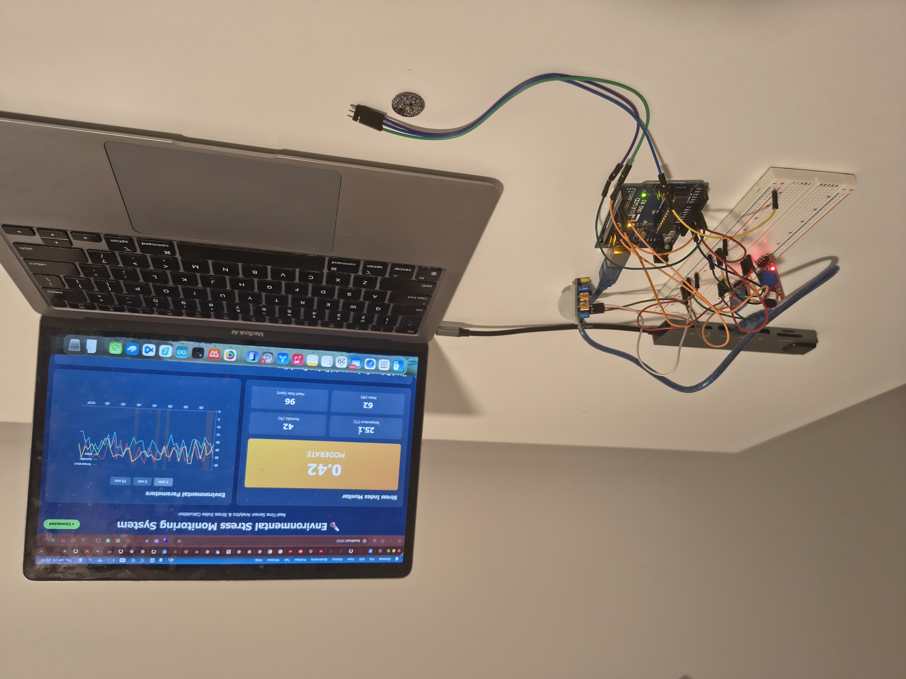
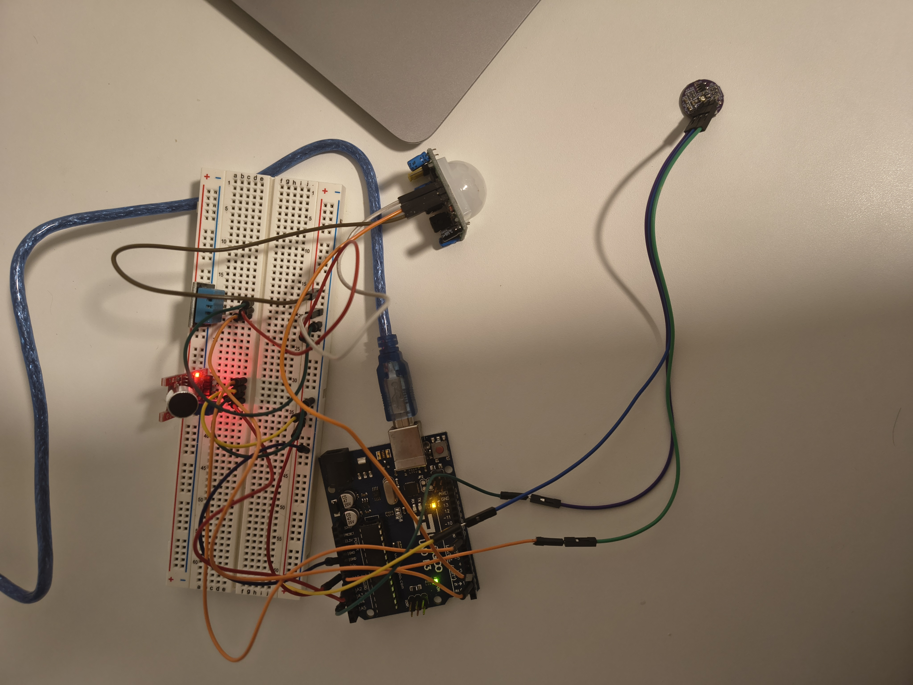
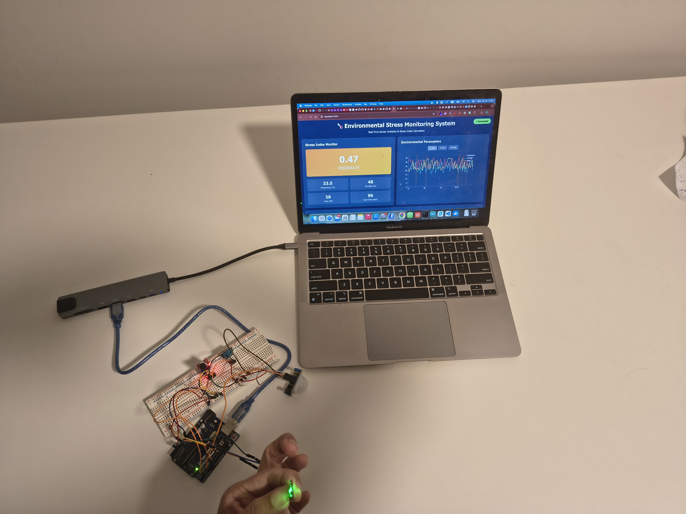

# 🌡️ Environmental Stress Monitoring System (ESMS)

A cloud-deployable, real-time sensor analytics system demonstrating **Innovation and Complexity Management (INCO)** principles through automated deployment, live data visualization, and end-to-end system integration.

---

#### demo page use api to render json data: https://esms.onrender.com/api/realtime



## 🎯 Project Overview

ESMS is a full-stack IoT application that:
- **Ingests** real-time environmental sensor data from Arduino Uno
- **Processes** data to calculate stress indices using weighted algorithms
- **Stores** data in Redis (real-time) and MySQL (historical)
- **Visualizes** live sensor changes with immediate frontend reactions
- **Deploys** automatically in GitHub Codespaces with zero configuration

---

# ESMS Backend

The **Environmental Stress Monitoring System (ESMS)** backend was fully implemented by **Dipendra Thapa**, providing fault-tolerant, secure, and real-time data processing features for sensor data collection, processing, and reporting.

## 🖥️ Backend Development

Key features and contributions:

### Data Processing & Stress Calculation
- Real-time ingestion of sensor data.
- JSON parsing and computation of stress index and stress levels.
- Handles edge cases and invalid sensor data gracefully.

### Fault Tolerance & Reliability
- Retry mechanisms with exponential backoff for database writes.
- In-memory buffering for temporary failures.
- Asynchronous persistence for smooth operation.
- Graceful shutdown with Docker auto-restart.
- Full-stack integration tests to ensure MySQL and Redis persistence and caching work reliably.

### Error Handling & Logging
- Centralized `error.rs` module for uniform error handling.
- Structured logging with `tracing`.
- Automatic retries on transient failures.
- Task-level survivability: one module failure does not crash the entire backend.
- Logs automatically captured and validated in CI/CD pipelines.

### FHIR Compliance & Data Validation
- FHIR Observation endpoint exposes stress index in healthcare-standard format.
- API responses validated for correct JSON structure.
- Partial input validation to prevent malformed or malicious sensor/FHIR data.

### Security & Configuration Management
- Parameterized MySQL queries to prevent SQL injection attacks.
- Dynamic environment-based configuration via `.env` and `.env.example`.
- Secrets injected securely through GitHub Actions.
- Automated configuration validation and simulated sensor fallback for CI/CD.

### Testing & Continuous Integration
- Unit tests for stress calculation, sensor parsing, and simulation edge cases.
- Integration tests with MySQL, Redis, and frontend interactions.
- Test coverage reports generated automatically with `cargo-tarpaulin`.
- Artifacts stored for CI/CD visibility and regression detection.

### Deployment & CI/CD Automation
- Dockerized backend container orchestrated with Docker Compose.
- Optimized multi-stage Docker builds for smaller images.
- Automated CI/CD pipeline with GitHub Actions:
  - **Code quality checks:** Clippy strict mode, Rustfmt formatting.
  - **Security audits:** `cargo-audit` for known vulnerabilities.
  - **Unit and integration testing** with coverage reports.
  - **Performance and load testing** using Apache Bench.
  - **Deployment validation** including env validation and Dockerfile checks.

### Development Environment Automation
- Rust toolchain and system dependencies installed automatically.
- Docker images built and cached for fast CI/CD builds.
- Reproducible environment for new developers and automated workflows.

## 🛠️ Technologies Used
- **Programming:** Rust, Actix-web, Tokio
- **Databases:** MySQL, Redis
- **DevOps & CI/CD:** Docker, Docker Compose, GitHub Actions
- **Healthcare Standards:** FHIR
- **Logging & Monitoring:** tracing
- **Testing & Coverage:** cargo-tarpaulin, Apache Bench

---

> ✅ This backend design ensures reliability, security, fault tolerance, real-time processing, FHIR compliance, and full CI/CD automation for production-ready deployment.


## 🔌 Hardware Setup (Arduino)



## 🖥️ Frontend Dashboard Preview



## 🎨 Frontend & Visualization

The frontend of ESMS was fully implemented by **Pritam Parmanik**, focusing on responsive, interactive, and real-time dashboards. Key contributions include:

- **UI/UX Design:** Responsive HTML5/CSS3 layouts, Flexbox/Grid, theming, dark mode, typography, cross-browser compatibility, and mobile-friendly design.  
- **Data Visualization:** Real-time D3.js charts, including line, scatter, and time series charts with axis scaling, legends, gridlines, color scales, motion/heat shading, and conditional formatting.  
- **Interactivity:** Dynamic DOM updates, event handling, hover effects, button filters, tooltips, state management, and real-time user feedback.  
- **API Integration:** JSON data fetching, asynchronous updates, error handling, auto-refresh polling, and status indicators.  
- **Performance & Maintenance:** Modular UI components, structured layout panels, performance optimization, debugging/logging, and CI/CD readiness.  
- **Advanced Analytics:** Interactive correlation analysis and environmental stress visualization tailored for sensor dashboards.  

Technologies used: **HTML5, CSS3, JavaScript, D3.js, Fetch API, Responsive Design, UI/UX Principles, CI/CD Ready**.

## 🏗️ System Architecture

```
┌─────────────┐      ┌──────────────┐      ┌─────────────┐
│  Arduino    │─────▶│  Rust        │─────▶│  Redis      │
│  Sensors    │ USB  │  Backend     │      │  (Real-time)│
└─────────────┘      │              │      └─────────────┘
                     │  - Serial I/O│
                     │  - JSON Parse│      ┌─────────────┐
                     │  - Stress Calc│─────▶│  MySQL      │
                     │  - REST API  │      │  (History)  │
                     └──────────────┘      └─────────────┘
                            │
                            │ HTTP/JSON
                            ▼
                     ┌──────────────┐
                     │  D3.js       │
                     │  Frontend    │
                     │              │
                     │  - Live Charts│
                     │  - Stress UI │
                     │  - Correlation│
                     └──────────────┘
```

---

## 🔌 Hardware Integration & Arduino Programming

The hardware and firmware of ESMS were fully implemented by **Shokhjahon Kodirov**, focusing on real-time sensor data acquisition and robust microcontroller integration. Key contributions include:

- **Microcontroller Programming:** Arduino Uno firmware in C/C++, modular function decomposition, loop-based non-blocking processing, and event-driven design.  
- **Sensor Integration:** DHT11 temperature & humidity, PIR motion, analog sound, and heart rate pulse sensors, including calibration, threshold-based event detection, and peak detection.  
- **Signal Processing:** Heart rate BPM calculation, pulse waveform analysis, noise mapping, data smoothing, sampling/reporting interval management, and fallback checks.  
- **Data Management:** Serial communication, JSON formatting, real-time data streaming, output standardization for backend integration, and elapsed time calculation without RTC.  
- **Hardware Setup:** Breadboard wiring, pin configuration, multi-sensor interfacing, low-power robustness, safety, and error handling for reliable sensor readings.  
- **IoT Readiness:** Real-time monitoring, fault-tolerant sensor data, and robust low-level hardware interfacing for full-stack integration.  

Technologies used: **Arduino Uno, C/C++, DHT11, PIR Sensor, Pulse Sensor, Analog Sound Sensor, Serial Communication, JSON, Breadboard Prototyping, Modular Firmware Design**.

## 🎥 Project Demonstration Video

[▶ Watch ESMS System Demonstration](https://www.youtube.com/watch?v=32hFvySmPG8)


## 📊 Stress Index Calculation

The system calculates environmental stress using a weighted formula:

```
Stress Index = (normalized_heart_rate × 0.5)
             + (temperature / 50 × 0.2)
             + (humidity / 100 × 0.2)
             + (noise / 100 × 0.1)
```

**Stress Levels:**
- **Low** (< 0.3): Green indicator
- **Moderate** (0.3 - 0.6): Yellow indicator
- **High** (> 0.6): Red indicator

The frontend **immediately reacts** to stress changes through:
- ✅ Color transitions on stress panel
- ✅ Live graph updates (1-second polling)
- ✅ Motion-based shading on time series
- ✅ Highlighted high-stress points in correlation plots

---

## 🚀 Quick Start

### **Option 1: Local Deployment (with Arduino)**
#### Run the System
### **Running Locally**

1. **Setup Environment**
   - Copy `.env.example` to `.env`:
     ```bash
     cp .env.example .env
     ```
   - Open `.env` and **choose your setup**:
     - Uncomment the local settings if running locally  
     - Uncomment the Docker settings if running in Docker  
     ⚠ Comment the other one to avoid conflicts.

2. **Database Setup**
   - Make sure MySQL server is running.
   - Create the database and tables from `init.sql`:
     ```bash
     mysql -u your_mysql_user -p < init.sql
     ```

3. **Start Redis Server**
   - Make sure Redis server is running:
     ```bash
     redis-server
     ```
     Or if installed via Homebrew:
     ```bash
     brew services start redis
     ```

4. **Run Backend**
   - Start the Rust backend:
     ```bash
     cargo run
     ```

5. **Run Frontend**
   - Navigate to your frontend folder and start a simple HTTP server:
     ```bash
     python3 -m http.server 3000
     ```
   - Open browser at `http://localhost:3000`

> Now your backend, frontend, MySQL, and Redis are all running locally.


#### Prerequisites
- Docker & Docker Compose
- Arduino Uno with sensors connected to `/dev/cu.usbmodem113401`
- Rust 1.75+ (optional, for development)

#### Arduino Data Format
Your Arduino must send JSON over serial at 9600 baud:
```json
{
  "temperature": 30.5,
  "humidity": 65,
  "noise": 70,
  "heart_rate": 85,
  "motion": true,
  "timestamp": "2026-01-20T10:00:00Z"
}
```

### **Running In docker**
#### Prerequisites
- Docker & Docker Compose
- Arduino Uno with sensors connected to `/dev/cu.usbmodem113401`
- Rust 1.75+ (optional, for development)

#### Arduino Data Format
Your Arduino must send JSON over serial at 9600 baud:
```json
{
  "temperature": 30.5,
  "humidity": 65,
  "noise": 70,
  "heart_rate": 85,
  "motion": true,
  "timestamp": "2026-01-20T10:00:00Z"
}
```

```bash
# Clone repository
git clone <your-repo-url>
cd esms

# Start all services
docker-compose up --build

# Access the dashboard
open http://localhost:3000
```

**Services:**
- Frontend: `http://localhost:3000`
- Backend API: `http://localhost:8080`
- Redis: `localhost:6379`
- MySQL: `localhost:3306`

---

### **Option 2: Cloud Deployment (GitHub Codespaces)**

#### Why Codespaces?
✅ No Arduino required - uses **simulated sensor data**  
✅ Zero configuration - works out of the box  
✅ Same codebase for local and cloud  

#### Steps
1. **Open in Codespaces**
   - Click "Code" → "Create codespace on main"
   
2. **Start Services**
   ```bash
   docker-compose up --build
   ```

3. **Access Dashboard**
   - Click "Ports" tab
   - Open port 3000 (Frontend)
   - Backend runs on port 8080

#### Simulation Mode
When serial port is unavailable, the backend automatically generates realistic sensor data every second:
- Temperature: 20-35°C
- Humidity: 40-80%
- Noise: 50-90 dB
- Heart Rate: 60-100 bpm
- Motion: Random (30% probability)

---

## 🔌 API Endpoints

### **GET /health**
Health check endpoint
```json
{
  "status": "healthy",
  "timestamp": "2026-01-24T10:00:00Z"
}
```
# Test Health endpoint(it taste sql and redis by pinging)
Returns redis data
```bash
curl "curl http://localhost:8080/health"
```


### **GET /api/realtime**
Returns last 60 seconds of data from Redis
```json
[
  {
    "data": {
      "temperature": 28.5,
      "humidity": 62,
      "noise": 65,
      "heart_rate": 78,
      "motion": false,
      "timestamp": "2026-01-24T10:00:00Z"
    },
    "stress_index": 0.42,
    "stress_level": "Moderate"
  }
]
```


# Test Redis endpoint
Returns redis data
```bash
curl "curl http://localhost:8080/api/redis"
```


### **GET /api/history?start=&end=**

# Test historical data
Returns historical data from MySQL
```bash
curl "http://localhost:8080/api/history?start=2026-01-24T09:00:00Z&end=2026-01-24T10:00:00Z"
```

### **GET /api/fhir/observation**
Returns latest data in FHIR-compatible format
```json
{
  "resourceType": "Observation",
  "status": "final",
  "code": {
    "coding": [{
      "system": "http://loinc.org",
      "code": "85354-9",
      "display": "Stress Index"
    }]
  },
  "valueQuantity": {
    "value": 0.42,
    "unit": "index"
  },
  "component": [...]
}
```


---
# Test FHIR endpoint
Returns fhir observation data from MySQL
```bash
curl http://localhost:8080/api/fhir/observation
```


## 📈 Frontend Dashboard Components

### 1. **Stress Index Monitor**
- Real-time stress value with color coding
- Live statistics for all sensor readings
- Smooth transitions on value changes

### 2. **Environmental Time Series**
- Multi-line chart (Temperature, Humidity, Noise)
- Motion periods shown as orange shaded regions
- Time filters: 1 min, 5 min, 15 min
- Interactive tooltips with exact values

### 3. **Correlation Analysis**
- Scatter plot: Heart Rate vs Environmental Factors
- Color-coded by sensor type
- Highlights high-stress periods (motion = false)
- Larger dots for stress > 0.6

### 4. **Interactivity**
- Dynamic axis scaling
- Hover tooltips
- One-second update rate
- Responsive design

---

## 🔄 CI/CD Pipeline

The GitHub Actions workflow (`.github/workflows/ci-cd.yml`) ensures:

### **1. Code Quality**
- ✅ Rust: cargo check, clippy, fmt
- ✅ Frontend: HTML validation
- ✅ Docker build verification

### **2. Integration Testing**
- ✅ Backend health endpoint
- ✅ Real-time API returns valid JSON
- ✅ FHIR observation structure
- ✅ Frontend accessibility

### **3. Cloud Compatibility**
- ✅ Codespaces devcontainer validation
- ✅ Simulated sensor mode verification
- ✅ docker-compose config check

### **4. Security**
- ✅ Trivy vulnerability scanning
- ✅ SARIF upload to GitHub Security

**Triggers:**
- Push to `main` or `develop`
- Pull requests to `main`

---

## 🗄️ Data Storage

### **Redis (Real-time)**
- Stores last **10 minutes** (600 data points)
- In-memory for fast access
- Used by `/api/realtime` endpoint
- Thread-safe with Tokio Mutex

### **MySQL (Historical)**
- Stores **all historical data**
- Schema:
  ```sql
  sensor_data (
    id, temperature, humidity, noise,
    heart_rate, motion, stress_index,
    stress_level, timestamp, created_at
  )
  ```
- Indexed on `timestamp` and `stress_level`
- Used by `/api/history` endpoint

---

## 🛠️ Technology Stack

| Layer | Technology | Purpose |
|-------|-----------|---------|
| **Backend** | Rust + Actix-web | High-performance async I/O |
| **Frontend** | HTML + D3.js | Data visualization |
| **Real-time DB** | Redis | Last 10 minutes cache |
| **Historical DB** | MySQL 8.0 | Persistent storage |
| **Containerization** | Docker + Compose | Deployment automation |
| **CI/CD** | GitHub Actions | Build, test, deploy |
| **Cloud** | GitHub Codespaces | Zero-config environment |

---

## 📂 Project Structure

```
esms/
├── Aurdino/
│   ├── aurdinouno.ino
├── backend/
│   ├── src/
│   │   └── main.rs           # Rust backend
│   │   └── api.rs
│   │   └── background.rs
│   │   └── business.rs
│   │   └── config.rs
│   │   └── error.rs
│   │   └── models.rs
│   │   └── retry.rs
│   │   └── sensor.rs
│   │   └── state.rs
│   │   └── storage.rs  
│   ├── Cargo.toml            # Dependencies
│   └── Dockerfile            # Backend container
├── frontend/
│   ├── index.html            # D3.js dashboard
│   ├── nginx.conf            # Web server config
│   └── Dockerfile            # Frontend container
├── .github/
│   └── workflows/
│       └── ci-cd.yml         # CI/CD pipeline
├── .devcontainer/
│   └── devcontainer.json     # Codespaces config
├── docker-compose.yml        # Multi-container orchestration
├── init.sql                  # MySQL schema
└── README.md                 # This file
```

---

## 🎓 INCO Evaluation Criteria

### **1️⃣ Automatic Cloud Deployment**
✅ **One-command startup:** `docker-compose up`  
✅ **GitHub Codespaces ready:** Zero manual configuration  
✅ **CI/CD verification:** Automated on every commit  

### **2️⃣ Direct Frontend Effect from Sensor Data**
✅ **Visible real-time updates:** 1-second polling interval  
✅ **Color changes:** Stress indicator transitions (green/yellow/red)  
✅ **Live graphs:** D3.js redraws on every data point  
✅ **Motion shading:** Orange regions for motion periods  

### **3️⃣ End-to-End Complexity Management**
✅ **Hardware integration:** Arduino serial communication  
✅ **Data processing:** JSON parsing + stress calculation  
✅ **Storage layer:** Redis (cache) + MySQL (persistence)  
✅ **API layer:** RESTful endpoints with FHIR compatibility  
✅ **Visualization:** Multi-chart dashboard with correlation analysis  
✅ **Deployment:** Docker orchestration + GitHub Actions  

---

## 🔧 Development

### **Backend Development**
```bash
cd backend
cargo run
```

### **Frontend Development**
```bash
cd frontend
python3 -m http.server 3000
# Open http://localhost:3000
```

### **View Logs**
```bash
docker-compose logs -f backend
docker-compose logs -f frontend
```

### **Reset Databases**
```bash
docker-compose down -v
docker-compose up --build
```

---


## 🧪 Testing

### **Manual API Testing**
```bash
# Health check
curl http://localhost:8080/health

# Real-time data
curl http://localhost:8080/api/realtime | jq

# Historical data
curl "http://localhost:8080/api/history?start=2026-01-24T00:00:00Z&end=2026-01-24T23:59:59Z" | jq
```

### **Automated CI/CD**
Push to GitHub and check Actions tab for:
- Build status
- Test results
- Security scan reports

---

## 🐛 Troubleshooting

### **Serial Port Not Found**
```bash
# macOS - Find your Arduino port
ls /dev/cu.*

# Update docker-compose.yml with correct port
SERIAL_PORT=/dev/cu.usbmodem113401
```

### **Frontend Can't Connect to Backend**
- Check backend is running: `curl http://localhost:8080/health`
- Verify ports in `docker-compose.yml`
- Check browser console for CORS errors

### **Simulated Data in Local Mode**
If Arduino is connected but simulation runs:
- Verify serial port name
- Check Arduino is sending valid JSON
- View backend logs: `docker-compose logs backend`

---

## 📝 License

This project is created for educational purposes as part of the Innovation and Complexity Management (INCO) course.

---

## 👥 Contributors

- Pritam Pramanik - Frontend & Visualization
- Dipendra Thapa - Backend & Integration
- Shokhjahon Kodirov - Hardware Integration & Arduino Programming 

---

## 🙏 Acknowledgments

- **INCO Course Team** for project requirements
- **Anthropic Claude** for system architecture guidance
- **Rust Community** for async I/O libraries
- **D3.js** for powerful visualization primitives

---

**🚀 Ready to deploy? Run `docker-compose up` and access http://localhost:3000**
